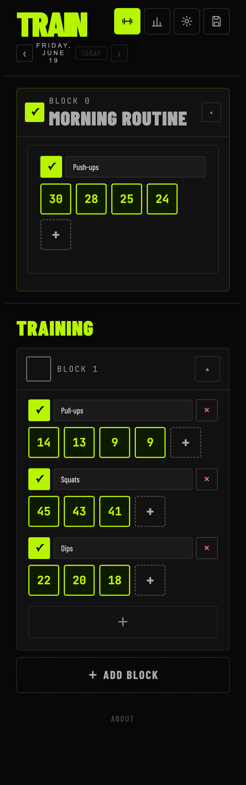
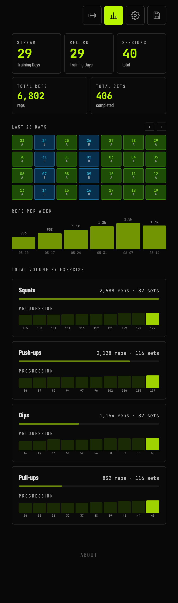
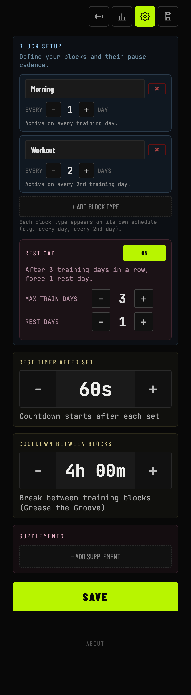
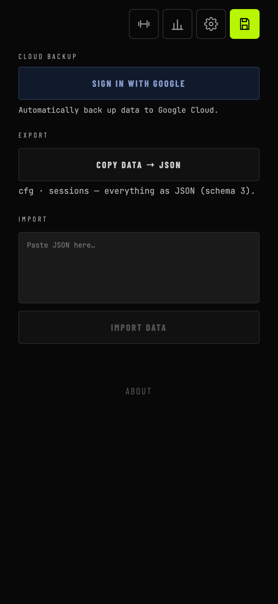

# F1L0 — Fitness Logger

A minimalist calisthenics tracker for **grease-the-groove** training. Plan independent block types on their own cadence, log sets and reps, and watch your volume climb. Built as an offline-capable PWA with optional Firebase cloud sync.

| Protocol | Stats | Settings | Data |
| :---: | :---: | :---: | :---: |
|  |  |  |  |

## Demo

- https://f1l0.nickyreinert.de/
- Use at your own risk. No support, no warranty.
- Sign-in via Google/Firebase — your data flows through their infrastructure.
- No liability for data loss or service interruptions.

## Features

- **Block-based protocol** — each day is built from blocks you check off as you go. Log sets and reps per exercise; the previous session's reps carry over as targets.
- **Per-block-type cadence** — every block type runs on its own schedule (every day, every 2nd day, …). No fixed "day 1 / day 2" rotation — block types are independent.
- **Grease the groove** — split training into multiple blocks per day with a cooldown countdown between them. Check off a block to start its timer; edit the start time in 15-minute steps.
- **Rest cap** — optionally force a rest day after a configurable streak of training days.
- **Rest timer** — a configurable countdown after each set.
- **Stats** — streak, record, session count, total reps/sets, a 28-day activity grid, reps-per-week bars, and per-exercise volume with a progression sparkline.
- **Tabbed views** — switch between Protocol, Stats, Settings, and Data inline from the top icon bar; no modals.
- **Cloud sync** — sign in with Google to back up and sync across devices. Last edit wins per day, so a workout logged on your phone shows up on your desktop.
- **Import / export** — copy everything to JSON (schema 3) or paste it back.
- **PWA** — installable, works offline via a service worker.

## Tech

No-build React app (`htdocs/index.html` + `htdocs/js/`, React + Babel run in-browser). JSX modules are concatenated by a small loader into one shared scope. Data lives in `localStorage` and syncs to Firebase Firestore. Hosted on Netlify; a serverless function injects the Firebase config so keys stay out of the source.

## Local development

Firebase config is served at runtime by a Netlify function from environment variables.

```bash
cp .env.example .env   # fill in your Firebase project values
npm i -g netlify-cli
netlify dev            # serves htdocs/ + the firebase-config function
```

Without Firebase credentials the app still runs fully offline; only cloud sync is disabled.

## Deployment

Netlify, configured via `netlify.toml`:

- **Publish directory:** `htdocs`
- **Functions:** `netlify/functions`
- Set the `FIREBASE_*` variables (see `.env.example`) in the Netlify dashboard.

## License

MIT
