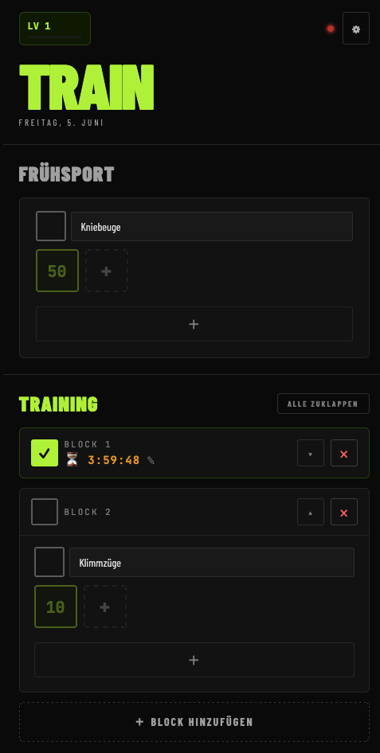

# F1L0 — Fitness Logger

A calisthenics tracker with RPG progression. Log workouts, earn XP, and grow a tree as you level up. Built as an offline-capable PWA with optional Firebase cloud sync.



## Demo

- https://f1l0.nickyreinert.de/
- Use at your own risk. No support, no warranty.
- Sign-in via Google/Firebase — your data flows through their infrastructure.
- No liability for data loss or service interruptions.

## Features

- **Workout logging** — track sets and reps per exercise, with A/B training-day cycling and a configurable rest timer between sets.
- **Grease the groove** — split training into multiple blocks per day, each with a cooldown countdown between them. Check off a block to start its timer; edit the start time in 15-minute steps.
- **RPG progression** — XP, levels, streaks, recovery days, and unlockable achievements. A tree grows through stages as your level rises.
- **Stats** — per-exercise progression, weekly volume, streaks, and a 28-day activity grid.
- **Cloud sync** — sign in with Google to back up and sync across devices. Last edit wins per day, so a workout logged on your phone shows up on your desktop.
- **PWA** — installable, works offline via a service worker.

## Tech

Single-file React app (`htdocs/index.html`, no build step — React + Babel run in-browser). Data lives in `localStorage` and syncs to Firebase Firestore. Hosted on Netlify; a serverless function injects the Firebase config so keys stay out of the source.

## Local development

Firebase config is served at runtime by a Netlify function from environment variables.

```bash
cp .env.example .env   # fill in your Firebase project values
npm i -g netlify-cli
netlify dev            # serves htdocs/ + the firebase-config function
```

Without Firebase credentials the app still runs fully offline; only cloud sync is disabled.

## Deployment

Netlify, configured via `netlify.toml`:

- **Publish directory:** `htdocs`
- **Functions:** `netlify/functions`
- Set the `FIREBASE_*` variables (see `.env.example`) in the Netlify dashboard.

## License

MIT
